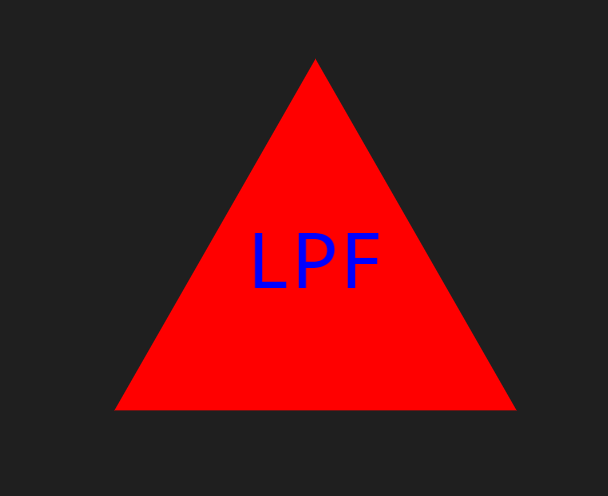

# SVG-Logo-Maker-OOP
 

 
 

## Description
This project is about creating an SVG Logo from the Command Line Interface. It features three shapes that the user can choose from, then allows for selecting colors for the letters and the shape's background. Even though the output may seem simple compared to the magnitude of the code, this project serves as a demonstration of Object-Oriented Programming. It showcases how to use classes, objects, and functions, as well as how they inherit properties and parameters from one another.

  ## Table of Content
  * [Description](#description)
  * [Installation](#installation)
  * [Usage](#usage)
  * [Contributors](#contributors)
  * [Test](#test)
  * [License](#license)
  * [Questions](#questions)
  * [Resources](#Resources)

## Installation
For installation, in the CLI run the npm install inquirer@8.2.4. You can install the most updated version if necessary. Next, npm jest  for test purposes.

Dependencies:
* "jest": "^29.6.2"
* "inquirer": "^8.2.4"

## Usage
After cloning of working this project, run "npm i" in the CLI and then run 'node index.js', or your main file. It will be "node mainFile.js"

## Contributors
If you wish to contribute to the project, please contact me through my GitHub account.

## Test
To test the project, given that the dependencies should already have been installed, run in the CLI "npm test".

## License
MIT License

Copyright (c) 2023 elchinatalpf

Permission is hereby granted, free of charge, to any person obtaining a copy
of this software and associated documentation files (the "Software"), to deal
in the Software without restriction, including without limitation the rights
to use, copy, modify, merge, publish, distribute, sublicense, and/or sell
copies of the Software, and to permit persons to whom the Software is
furnished to do so, subject to the following conditions:

The above copyright notice and this permission notice shall be included in all
copies or substantial portions of the Software.

THE SOFTWARE IS PROVIDED "AS IS", WITHOUT WARRANTY OF ANY KIND, EXPRESS OR
IMPLIED, INCLUDING BUT NOT LIMITED TO THE WARRANTIES OF MERCHANTABILITY,
FITNESS FOR A PARTICULAR PURPOSE AND NONINFRINGEMENT. IN NO EVENT SHALL THE
AUTHORS OR COPYRIGHT HOLDERS BE LIABLE FOR ANY CLAIM, DAMAGES OR OTHER
LIABILITY, WHETHER IN AN ACTION OF CONTRACT, TORT OR OTHERWISE, ARISING FROM,
OUT OF OR IN CONNECTION WITH THE SOFTWARE OR THE USE OR OTHER DEALINGS IN THE
SOFTWARE.

## Questions
Any question, contact me here:

GitHub: https://github.com/elchinatalpf

## Resources
#### SVG Guidance
* https://developer.mozilla.org/en-US/docs/Web/SVG
* https://developer.mozilla.org/en-US/docs/Web/SVG/Tutorial/Getting_Started
* https://developer.mozilla.org/en-US/docs/Web/SVG/Tutorial/Texts
* https://developer.mozilla.org/en-US/docs/Web/SVG/Tutorial/Basic_Shapes
#### Colors
* https://www.geeksforgeeks.org/how-to-validate-hexadecimal-color-code-using-regular-expression/
* https://www.w3schools.com/cssref/css_colors.php
#### Packages
* https://www.npmjs.com/package/jest?activeTab=readme
* https://docs.npmjs.com/cli/v8/commands/npm-test
* https://www.npmjs.com/package/inquirer?activeTab=versions